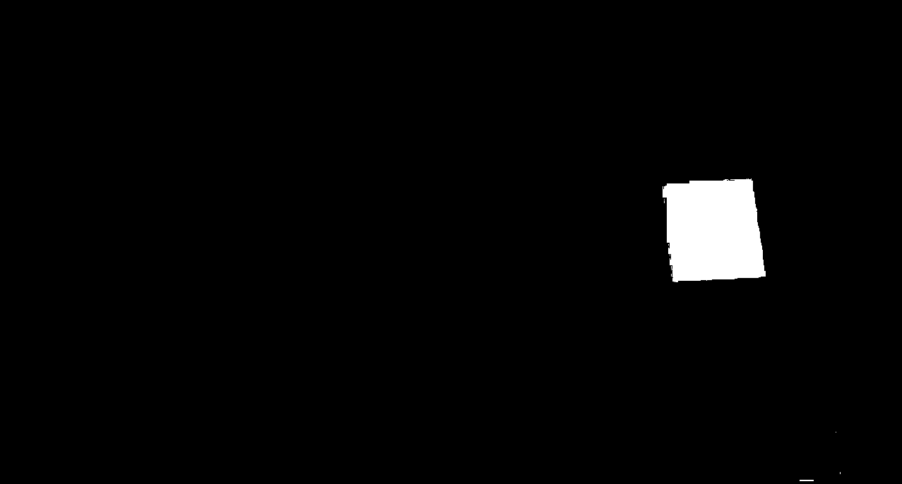
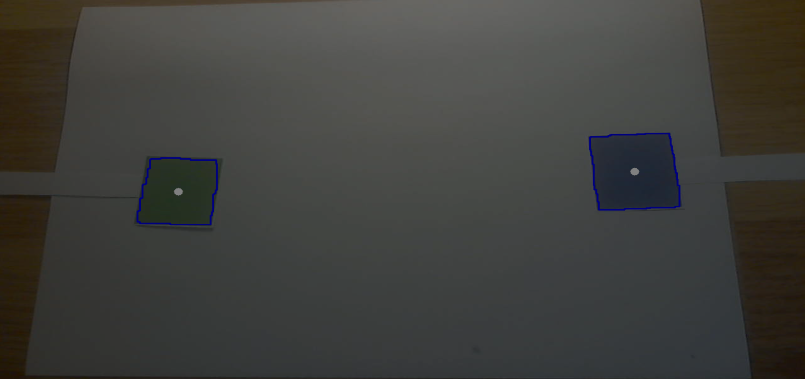

# AR Pong

Developers : Nathan Coustance & Nicolas Kleinhentz

University project used to learn how to use EmguCV, a .NET wrapper for OpenCV, into a Unity game.

*Read this in other languages : [French](README.md), [English](README.en.md).*

## Gameplay Loop

The gameplay loop corresponds to Pong :

The ball spawns in the center of the field with a random direction along a 90° angle towards the player that lost the last point.  
When reaching a player's goal, the ball reappears in the center of the field.  
The first player uses the green square and the second uses the blue one.

## ARed Controls

Controlling each players is achieved using colored squares, a green one and a blue one, moved in front of a webcam :

The webcam records the image and transfers it to a script using EmguCV to extract, firstly the green and lastly the blue from the image.  
Once done, the script seeks the squares contained in each of these images and uses their screen positions to move each player.  

### Detailed Process

- The recorded image is transferred to the script [(voir image 1)](#Annexes)
- This image is converted into HSV
- This conversion into HSV enables us to retrieve more easily the green and blue colors from the image [(voir images 2 et 3)](#Annex)
- We close the shapes' holes and remove artifacts with closing and opening morphological transformations [(voir images 4 et 5)](#Annexes)
- The image's outlines are detected using a Canny filter [(voir images 6)](#Annexes)
- The center of each shape is detected and is used to set the player Y position if the shape area is big enough.

## Annex

*Image 1 : image recorded by webcam*
  

*Images 2 & 3 : Isolating each color channels*
| 
Green channel
 | 
Blue channel
 |
| ------------- | ------------ |
|  |  |

*Images 4 & 5 : Applying morphological transformations to each channel*
| 
Green channel
 | 
Blue channel
 |
| ------------- | ------------ |
|  |  |

*Image 6 : Drawing contours and centers*
