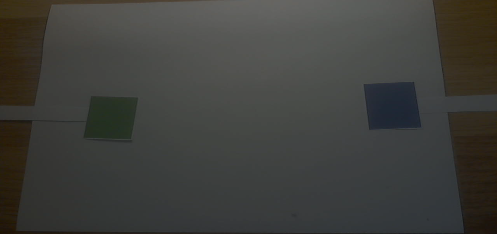
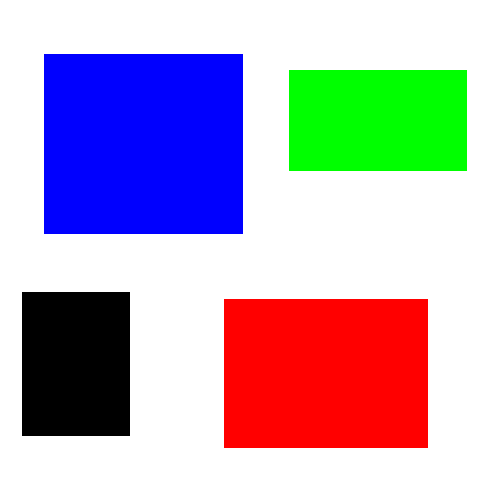
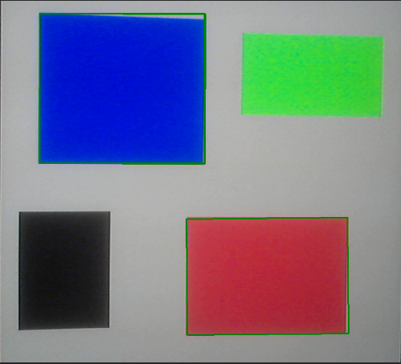

# AR Pong

Developers : Nathan Coustance & Nicolas Kleinhentz

University project used to learn how to use EmguCV, a .NET wrapper for OpenCV, into a Unity game.

*Read this in other languages : [French](README.md), [English](README.en.md).*

## Gameplay Loop

The gameplay loop corresponds to Pong :

The ball spawns in the center of the field with a random direction along a 90° angle towards the player that lost the last point.  
When reaching a player's goal, the ball reappears in the center of the field.  
The first player uses the red square and the second uses the blue one.

## ARed Controls

Controlling each players is achieved using colored squares, a red one and a blue one, moved in front of a webcam :

*[Placeholder : gif displaying the players controls using the webcam]*

The webcam records the image and transfers it to a script using EmguCV to extract, firstly the red and lastly the blue from the image.  
Once done, the script seeks the squares contained in each of these images and uses their screen positions to move each player.  

### Detailed Process

- The recorded image is transferred to the script
- This image is converted into HSV
- This conversion into HSV enables us to retrieve more easily the red and blue colors from the image [(see images 1, 2 and 3)](#Annex)
- The image's outlines are detected using a Canny filter
- For each of these outlines we retrieve some polygons
- We then only process the 4-sided polygons, using them to create bounding boxes [(see images 4 and 5)](#Annex)
- The bounding boxes are used to move each player based on the boxes screen position

## Annex

  
*Image 1 : webcam recorded image*

  
*Image 2 : red colors from the image (see Image 1)*

  
*Image 3 : blue colors from the image (see Image 1)*

  
*Image 4 : test image used for colored squares detection*

  
*Image 5 : red and blue squares detection on the test image (see Image 4)*