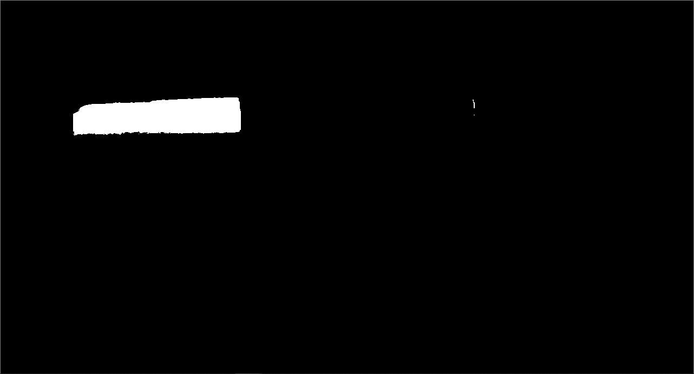
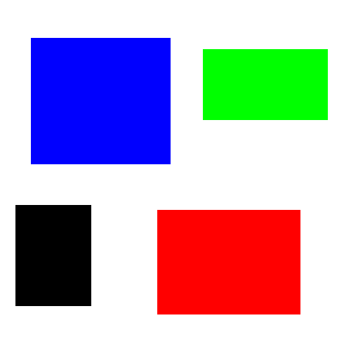
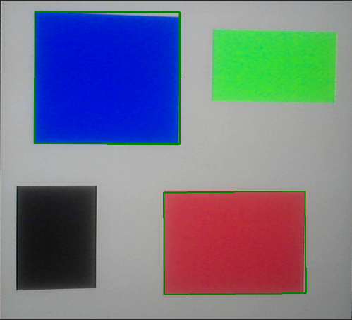

# AR Pong

Développeurs : Nathan Coustance & Nicolas Kleinhentz

Projet universitaire dans le but d'apprendre à se servir d'EmguCV, un wrapper .NET de la librairie OpenCV, le tout incorporé dans un jeu Unity.

*Read this in other languages : [French](README.md), [English](README.en.md).*

## Gameplay Loop

La gameplay loop correspond au jeu Pong :

La balle apparaît au milieu du terrain avec un direction aléatoire suivant un angle de 90° en direction du joueur ayant subit le dernier but.  
Lorsqu'elle rentre dans un but, la balle réapparait au milieu du terrain.  
Le joueur 1 est représenté par la plaque rouge et le 2 par la plaque 2.

## ARed Controls

Le contrôle des deux plaques se fait grâce à des carrés de couleurs, un rouge et un bleu, déplacés devant une webcam :

*[Placeholder : gif démontrant le déplacement des plaques grâce à la webcam]*

La webcam capte l'image et la transmet à un script utilisant EmguCV pour exraire, d'une part, le rouge de l'image et d'une autre le bleu.  
Une fois ceci fait, le script cherche les carrés contenus dans ces images et utilise leurs positions dans la caméra pour déplacer les plaques des joueurs.

### Processus détaillé

- L'image capturée par la webcam est transmise au script
- Cette image est convertie en HSV
- La conversion en HSV nous permet de récupérer plus facilement les éléments rouges et bleus de l'image [(voir images 1, 2 et 3)](#Annexes)
- Les contours de ces images sont détectés grâce à un filtre de Canny
- Pour chacun de ces contours on en récupère des polygones
- On traite ensuite seulement les polygones à 4 côtés, d'après lesquels on construit des boîtes englobantes [(voir images 4 et 5)](#Annexes)
- Les boîtes englobantes sont utilisées pour déplacer les plaques des joueurs par rapport à leur position dans l'écran

## Annexes

  
*Image 1 : capture de la webcam*

  
*Image 2 : couleur rouge de la capture (voir Image 1)*

  
*Image 3 : couleur bleue de la capture (voir Image 1)*

  
*Image 4 : image de test utilisée pour la reconnaissance de carrés colorés*

  
*Image 5 : détection de carrés rouges et bleus sur l'image de test (voir Image 4)*