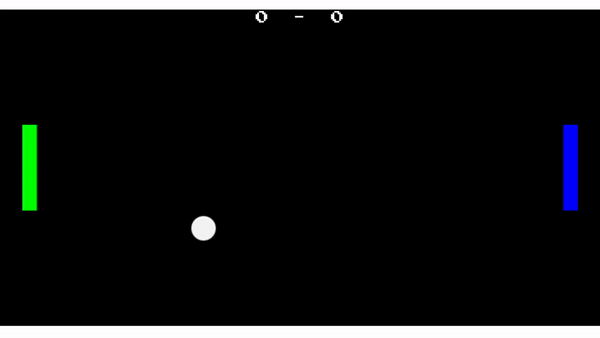
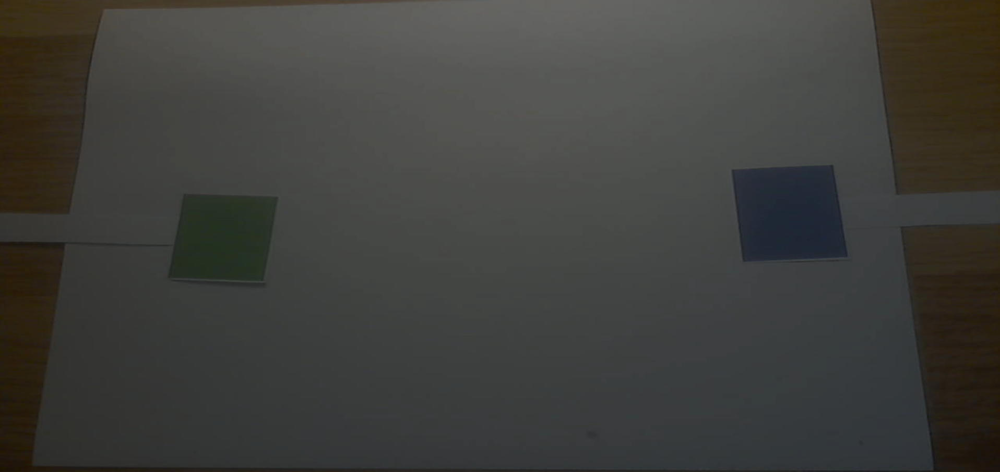
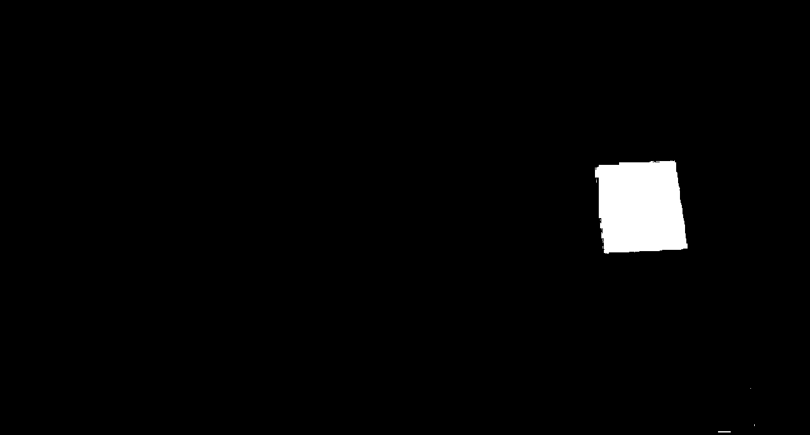
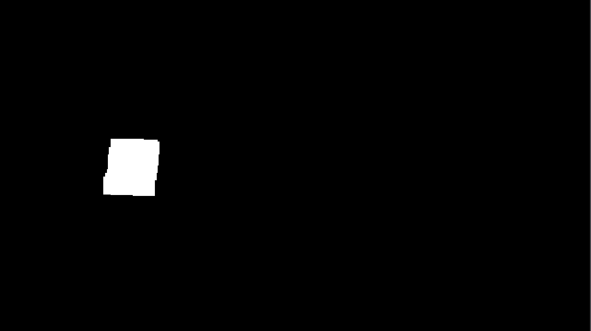
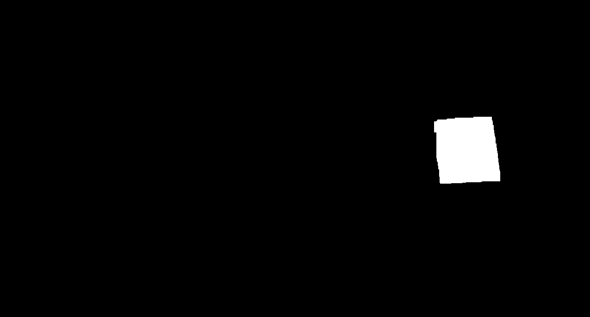
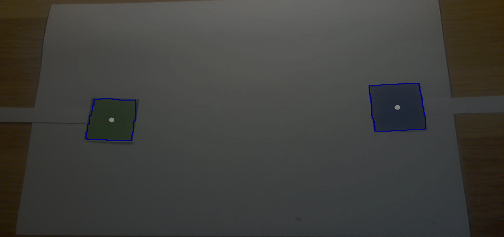

# AR Pong

Développeurs : Nathan Coustance & Nicolas Kleinhentz

Projet universitaire dans le but d'apprendre à se servir d'EmguCV, un wrapper .NET de la librairie OpenCV, le tout incorporé dans un jeu Unity.

*Read this in other languages : [French](README.md), [English](README.en.md).*

## Gameplay Loop

La gameplay loop correspond au jeu Pong :

La balle apparaît au milieu du terrain avec un direction aléatoire suivant un angle de 90° en direction du joueur ayant subit le dernier but.  
Lorsqu'elle rentre dans un but, la balle réapparait au milieu du terrain.  
Le joueur 1 est représenté par la plaque verte et le 2 par la plaque bleue.

## ARed Controls

Le contrôle des deux plaques se fait grâce � des carrés de couleurs, un vert et un bleu, déplacés devant une webcam :

La webcam capte l'image et la transmet à un script utilisant EmguCV pour exraire, d'une part, le vert de l'image et d'une autre le bleu.
Après avoir différencié les couleurs, on détecte leurs contours puis on en ressort la coordonnée centrale afin de déterminer la position Y du joueur.

### Processus détaillé

- L'image capturée par la webcam est transmise au script [(voir image 1)](#Annexes)
- Cette image est convertie en HSV
- La conversion en HSV nous permet de récupérer plus facilement les éléments verts et bleus de l'image [(voir images 2 et 3)](#Annexes)
- On ferme les trous des formes et on supprimes les artéfacts extérieurs à l'aide de 2 transformations morphologiques (close + open) [(voir images 4 et 5)](#Annexes)
- Les contours de ces images sont détectés grâce à un filtre de Canny [(voir images 6)](#Annexes)
- On récupère le milieu de chaque contour et si l'aire de la forme est supérieure à une certaine valeur, on utilise sa position Y pour déplacer le joueur.

## Annexes

*Image 1 : capture de la webcam*
  

*Images 2 & 3 : Isolation des couleurs sans transformation*
| 
Green channel
 | 
Blue channel
 |
| ------------- | ------------ |
|  |  |

*Images 4 & 5 : Isolation des couleurs avec transformation*
| 
Green channel
 | 
Blue channel
 |
| ------------- | ------------ |
|  |  |

*Image 6 : Dessin des contours et milieux*
